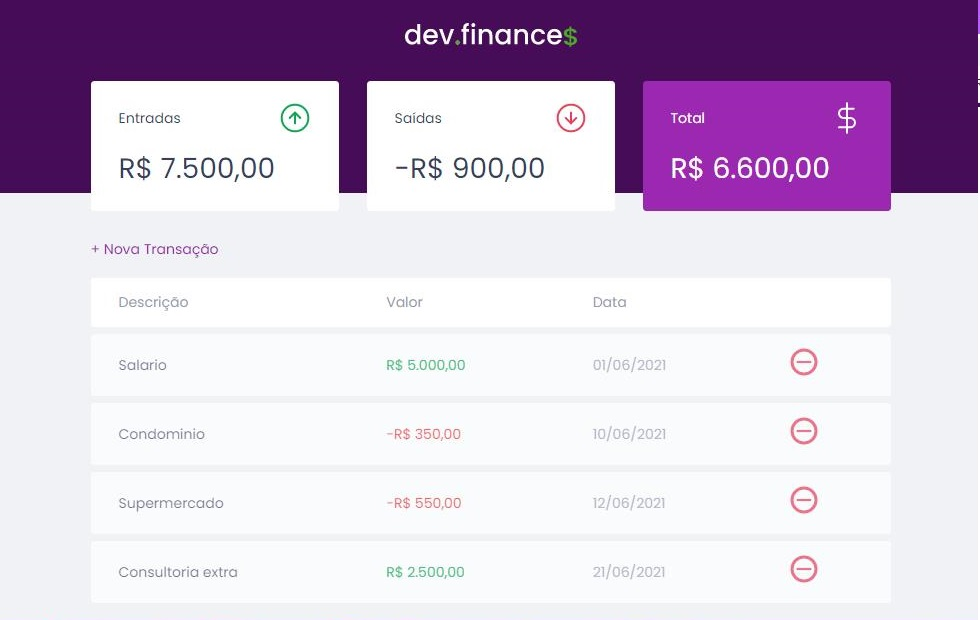

<h1 align="center"> Dev-Finances </h1>

  

## 💡 Projeto

 Aplicação de controle financeiro, onde é possível cadastrar e excluir transações, além de ver o saldo de entrada e saída. 

## ✅ Tecnologias utilizadas 
 - HTML
 - CSS
 - JavaScript

## ♥️ Contribuidores 

 Obrigada a todos que fazem parte da <a href="https://rocketseat.com.br/">Rocketseat</a> pela oportunidade de ensino. 

## 🔒 Licença

## 👩‍💻 Autora

<a href="https://www.linkedin.com/in/nayalla-lima/">
 
  
<b>Nayalla Lima</b></a> <a href="https://www.linkedin.com/in/nayalla-lima/">🚀</a> 
Feito com 💜️ por Nayalla Lima
 
Entre em contato 😀 

  